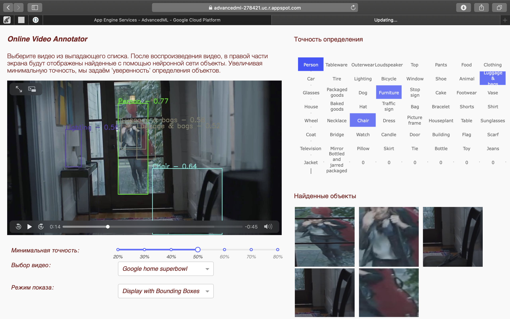

# Video-annotator

The web application demonstrates how you can use object detection models to find specific objects in different footages.

https://advancedml-278421.uc.r.appspot.com – this is the link to this web app deployed to Cloud App Engine.

